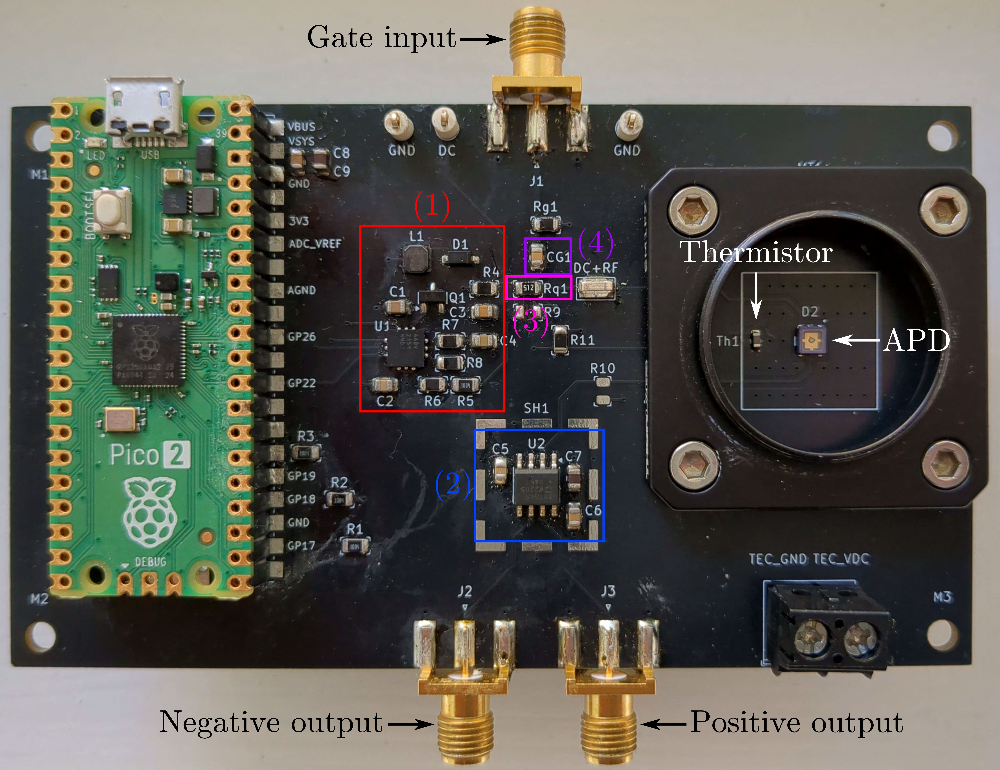
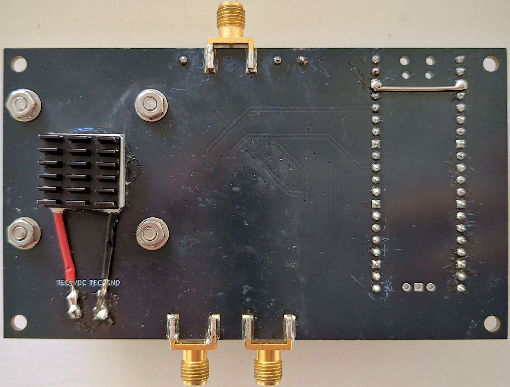

# OpenSPD

**OpenSPD** (Open-Source Single Photon Detector) is a hardware project for detecting single photons in the near-infrared (NIR) range, specifically designed for applications such as photonic side-channel analysis using hot-carrier luminescence (HCL) from integrated circuits. The project is centered around a compact, low-cost, and high-sensitivity InGaAs avalanche photodiode (APD) detection system.

This repository contains the full open-source hardware files including:

- 🧩 **KiCad project files** (schematics, layout)
- 📦 **Bill of Materials (BOM)**
- 📚 **Custom libraries**
- 🧾 Supporting documentation

## Features

- **Avalanche Photodiode (APD)**: Excelitas C30645L-080 for high NIR sensitivity.
- **Bias Supply**: Adjustable high-voltage bias using MAX1932 DC-DC converter.
- **Transimpedance Amplifier (TIA)**: High-speed current-to-voltage conversion using the AD8015.
- **Gate Input**: Supports (sinusoidal, square-wave) gated operation for time-selective photon detection.
- **Passive Quenching**: Simple passive quenching resistor for avalanche suppression.
- **Mechanical Mounting Interface**: Compatible with free-space optical setups

### Front Side

### Back Side

Date: May 2025
